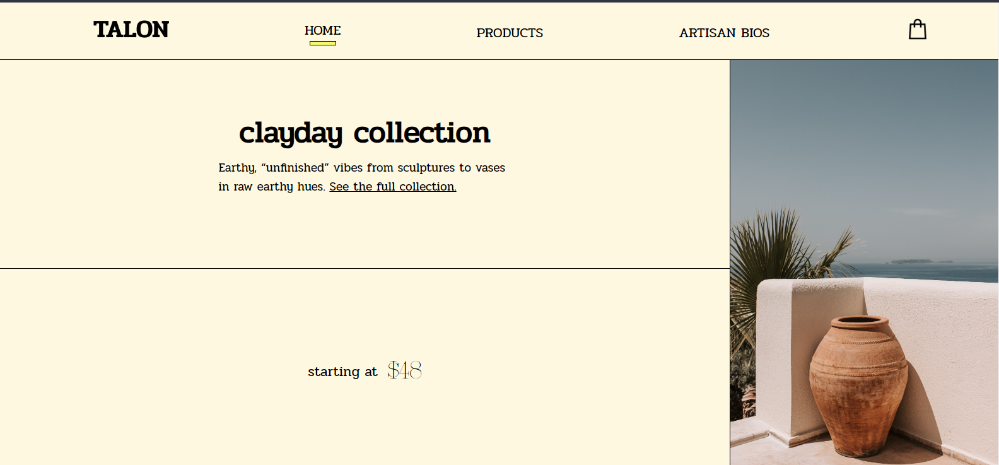
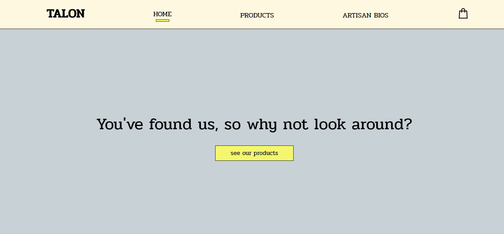
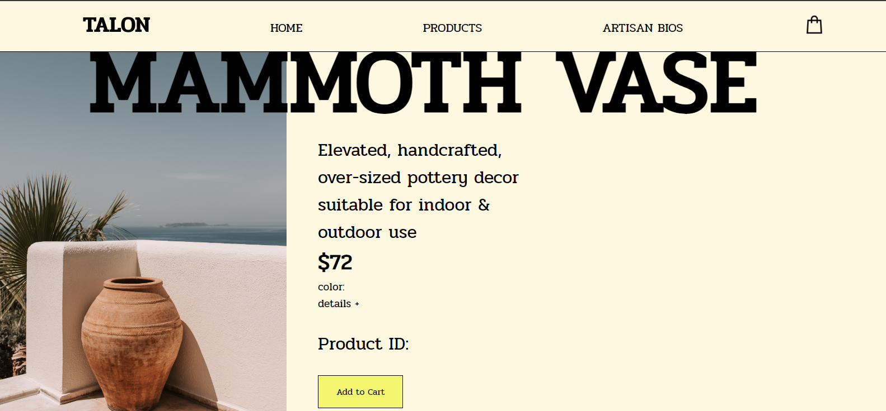
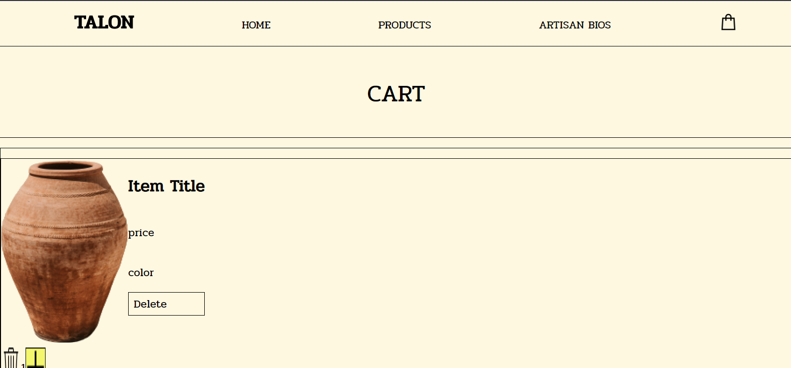

# Introduction:

Welcome to my e-commerce store using the MERN stack. TALON is a modern pottery and sculpture (mock) store with products made by artisans. Check out the Artisan Bios page, by the way . . .

This project is meant to have CRUD operations via a cart component where the user can add items to the cart, update quantities, and delete items from the cart.

## Let's get some visuals going:

Here's a screenshot of the home page:

Here's a bit more of what you'll see as you scroll down the homepage. I wanted to use full viewport "experiences" so that you scroll from one full experience to the next with one focus at a time:

One more piece of the homepage:

This is the products page. It uses gigantic product title names (I'm just loving the huge text and full-screen experience these days):

# Technologies Used:
### Programming Languages & Database(s)
I used MongoDB, Express, React, Node, (MERN), HTML, JavaScript, CSS, JSX to build this app. I planned to build my own API, but might end up sourcing an already existing one due to beginner's issues that will be worked out in the future.

## Figma
I really enjoy using Figma to design UIs and this project was no exception! (Figma is an "exceptional" design tool though :D)

# DEPLOYMENT LINKS:

Front-end: will use Render.com
Back-end: "

# UNSOLVED PROBLEMS:

I had some real trouble with getting my API to work. I'd like to add more products to the store, as much as a normal online store would have.

Here's a screenshot of the broken cart page. Besides the unfinished styling, I wanted to add a static image of a product so that you could see close to what it's supposed to look like. The information is supposed to load from my API functions:

I wanted to upload an example of what the image would look like if it loaded dynamically and the product name and color, but I'm still working on getting that going.

# DESIGN

This app has a modern, neutral color scheme, meant to bring warmth. It uses a visible grid design and gigantic font to add some more fun and visual appeal. As mentioned previously, I really took hold of the full viewport experience with images and elements that were meant to be seen all at once as the user scrolls.

## User Heuristics

Page indicators:
This is my first time implementing page indicators (outside of just changing the font-weight or color of the text) so that the user knows which page he/she is viewing. This time, I used yellow 
 bars that are seen in the navbar under the name of the page that the user is currently viewing. I just had to think of how to set up the elements and the CSS and it worked. I also used different navbar components for the React side to render and indicator for each page.

# CHALLENGES

I'm a very visual person and I know that the back-end is where the real work happens. I just like to put lots of energy into the front-end design and work from what I can see to what I don't see and bring them together that way.

Sometimes I wonder if I put too much emphasis on the design, but as long as the backend works properly, we can have pretty things to look at as well, so everyone wins. I just need to always make sure that I allot enough time to get the functionality together.

# SOURCES

### Getting the logo to slowly appear in the top left corner of the Home page after scrolling a set number of pixels (230px is my number for the TALON homepage):
https://laracasts.com/discuss/channels/javascript/bootstrap-navbar-changing-logo-on-scroll

I added a second "NavBar2" component for this to only happen on the Home page since there's already a gigantic logo there. However, when the user scrolls, that huge logo will scroll off-screen. Once it is no longer readable, the smaller logo will appear at the top left.

### Past Per Scholas assignments and projects for reference
The Fruits app, for example . . .

### I'm happy to report that this article helped me with importing the fonts that I downloaded and included in my Figma design file. I used the @fontface option since I'm using React and also because the fonts are not hosted online:

https://blog.greenroots.info/3-quick-ways-to-add-fonts-to-your-react-app

^^ Finding that really made my day! :D

## Image Sources:

Mammoth Vase Outdoors:
Photo by Vlada Karpovich from Pexels: https://www.pexels.com/photo/brown-clay-pot-in-the-corner-of-white-concrete-wall-7902913/

Rali Vase Collection:
Photo by ROMAN ODINTSOV from Pexels: https://www.pexels.com/photo/white-ceramic-pots-on-a-window-sill-8063809/

The Sandy Teapot:
Photo by Andre William from Pexels: https://www.pexels.com/photo/peach-color-teapot-and-plate-3010771/

Craftlife 1:
Photo by RF.\_.studio from Pexels: https://www.pexels.com/photo/ceramist-with-handmade-pottery-3817497/

Craftlife 2:
Photo by RF.\_.studio from Pexels: https://www.pexels.com/photo/stylish-woman-with-ceramic-bowls-in-creative-studio-3819792/

Arched Sculpture Set:
Photo by Allison Saeng
https://unsplash.com/photos/WO7nL4oLdP4

Incense Holder Hand:
Photo by Franco Antonio Giovanella
https://unsplash.com/photos/bodma3C2GHE

Pinky Hands:
Photo by Andrew Petrov
https://unsplash.com/photos/hopnkQoC0dg

Mint Jug Vase:
Photo by Jaikishan Patel
https://unsplash.com/photos/yS960iAbSqo

Mammoth Bundle:
Photo by Oshin Khandelwal
https://unsplash.com/photos/fq839fSNEuo

Artisan 1:
Photo by RF.\_.studio from Pexels: https://www.pexels.com/photo/calm-black-female-ceramist-with-handmade-pottery-3817495/

Artisan 2:
Photo by RF.\_.studio from Pexels: https://www.pexels.com/photo/calm-stylish-woman-with-creative-vase-in-workshop-3819794/

Artisan 3:
Photo by Antoni Shkraba from Pexels: https://www.pexels.com/photo/person-making-clay-pot-4706134/

### Some default text for reference . . .
 Getting Started with Create React App

This project was bootstrapped with [Create React App](https://github.com/facebook/create-react-app).

### Available Scripts

In the project directory, you can run:

### `npm start`

Runs the app in the development mode.\
Open [http://localhost:3000](http://localhost:3000) to view it in your browser.

The page will reload when you make changes.\
You may also see any lint errors in the console.

# Here are the Project Instructions

These instructions are mostly for my future reference. Some things will need to be added to this project at a later date, due to class time constraints (they weren't required at the time Oct 2023):

### Mod 3: A MERN Stack Application & TribleByte:

Overview
You’ve come a long way, and it's time to show it. This will be your most advanced project to date.

🚨 Before you start working on the planning for your project, be sure to review your idea with an instructional team to ensure that it both:

✅ Meets the minimum requirements

✅ Is reasonably scoped

Necessary Deliverables

1. Project Planning
   A project consists of more than just code.

This project requires planning organized within a Trello board with the following lists:

Icebox: Holds user stories that have yet to be moved to the Current/MVP list. All user stories are originally put into the Icebox, including both MVP and wish list stories.
Current/MVP: Holds user stories that must be completed to meet the minimum project requirements (MVP). Once the MVP has been met, additional user stories may be moved from the Icebox.
Completed: Hold completed user stories.
Wireframes: Sketches of each screens's user interface for the major functionality of the application.
Entity-Relationship-Diagram (ERD): A diagram of the app's models (one per data entity) and the relationships between them.
User stories need to be formed properly using this template:
As a <role>, I want <feature> so that <reason>. The reason is optional if it's patently obvious.

2. Project Source Control & README
   The project's source code for both your Express Backend and React Frontend must be hosted on a personal GitHub repository.

The repo is to contain frequent commits dated from the beginning of the project through its completion.

The project must include a README.mdfile with the following sections:

Introduction: A paragraph used to introduce interested parties to the project and needs to include one or more screenshots.
Technologies Used: A list of all technologies, libraries, APIs, etc. used in the project.
Getting Started: Links to the project's planning (Trello board) and the deployed app.
Unsolved Problems: List any unsolved issues.
Future Enhancements: Identify future features and enhancements planned for the project.

3. Application Technical Requirements/Deliverables
   A functioning full-stack, single-page application for (Express) and a CDN service for (React).
   Incorporate the technologies of the MERN-stack:

MongoDB/Mongoose
Express
React
Node
Have a well-styled interactive front-end that communicates with the Express backend via AJAX.
Implement token-based authentication - "...a user can sign-up, log in & log out".
Implement authorization by restricting functionality to authenticated users.
Navigation should respond to the login status of the user.
One User data entity minimum, which will be used for Auth; other data entities can be added and related if desired but are not required.
Have a comprehensive feature-set.

Full CRUD distributed across all Data Entities

Or

One of the following features instead:

(Easy) - Consume a third-party API and display API data in components.
(Moderate) - Include an admin interface w/features.
(Hard) - Utilize multi-user, real-time communications (difficult and time consuming)

4. Project Presentation
   You will have 7 minutes to present and demonstrate the following:

Introduce your project by paraphrasing its README.
Click the link in the README to open the deployed app.
Demonstrate the application's authentication features by signing up a new user, logging out that user, then logging in with your preferred user.
Demonstrate your app's main features.
Share/discuss the following code (not line-by-line):

The main/central Mongoose model
Your "favorite" Express controller method
Your "favorite" React component
The client-side routing
Share the experience by answering the following:

What was your biggest challenge?
What are your key learnings/takeaways?
Following your presentation, there will be a brief Q & A period and optional instructor feedback.

Project Assistance
At this stage of SEIR, being able to find the the answers to your development issues is of paramount importance.
Feel free to use all resources available and collaborate with others.
If you do seek assistance in Slack, explain the issue, include screenshots, and explain what you've done to solve the issue on your own.

Suggestions to Get Started
Don’t get too caught up in too many awesome features – simple is better. Favor fewer features that look/feel impressive over numerous clunky/sloppy features.
Implement the Usermodel and authentication first. Then implement the "As a visitor, when I browse to the app, I want..." user story.
Prioritize user stories and code them accordingly.
When implementing a feature, think through the steps that it takes in plain language first. If necessary, write and/or diagram the steps to help guide your coding.
Follow the steps we've done in class to implement features, beginning with the user's interaction, identifying the proper route, etc.
Read the docs for whatever technologies / frameworks / API’s you use.

Best Practices
Write DRY code.
In a SPA, communication with the backend is via AJAX. Build RESTful APIs to CRUD your data entities (resources) and perform other functionality via AJAX. In a React app, those AJAX calls should be made from "service" modules, not components.
Be consistent with your code style.
Clearly name variables and functions - remember, variables are usually named as nouns and functions as verbs.
Write well-formatted HTML/CSS/JS. Properly formatting your code makes it more readable. Improperly formatted code infers sloppiness.
Comment your code where it makes sense. Most code is self-documenting, however, comments help explain complicated code.
If you have any questions regarding these requirements, please feel free to contact your instructional team!
What is TripleByte

Triplebyte is the engineering industry's largest directory of skilled, technically-assessed software engineers. They connect companies with tens of thousands of engineers who are actively seeking or open to learning about new opportunities. Engineers come to them because they help streamline their job search and certify their abilities. Employers come to them because they make their sourcing easier and more effective by pre-screening candidates and providing quick ways to connect with talented engineers, including those from underrepresented groups.

How does TripleByte Assess Engineers
Engineers complete various adaptive online quizzes (most quizzes are multiple-choice and some require actually writing code). Trained on over 300,000 engineers, the Triplebyte evaluation uses machine learning to identify talented candidates.

We've developed a set of questions and a well-defined rubric to ensure standardization across candidate scoring. The quizzes ask each candidate different questions from our large pool of potential questions, based on where they have shown strength and weakness. By doing this we are able to get more accurate results in a shorter amount of time. The statistical model we use for our quiz (item response theory) is similar to what is behind the GRE and GMAT tests.

Most of the quiz questions involve looking at blocks of code and answering questions about them (finding bugs and predicting behavior). Some questions test specific knowledge.
